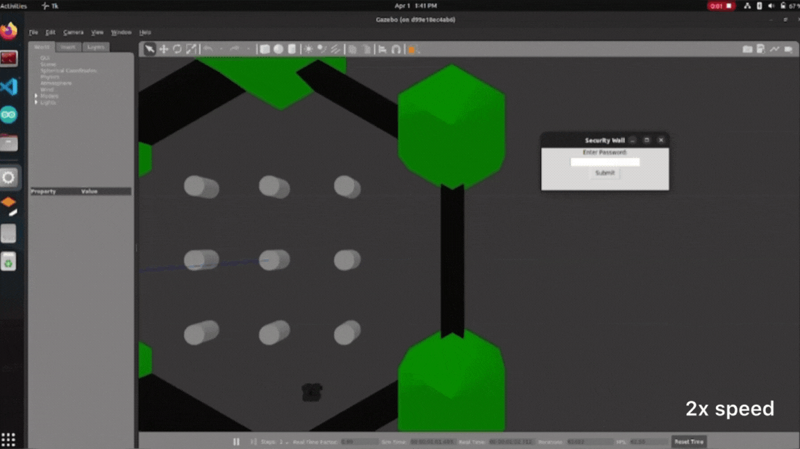

# Table of Contents

Click to expand

   * [What is this?](#what-is-this)
   * [Requirements](#requirements)
   * [How it works](#how-it-works)
      * [Security](#security)
      * [Mine Logging](#mine-logging)
      * [Buttons](#buttons)
      * [User Interface](#user-interface)
   * [How to use](#how-to-use)
   * [Demo](#demo)
  

# What is this?
This ROS package was developed with the intent to provide GPS-waypoint based autonomous navigation for an Autonomous Vehicle for Detecting Landmines (AVDL); my senior year Engineering project at Florida International University (FIU). It consists of a GUI where the user can see the current location of the robot, location of detected landmines, input waypoint locations, and utlize buttons to control the robot.

# Requirements
**Tested on:**

- Ubuntu 20.04 (ROS Noetic)

**Open Source Packages**

- common_msgs

- gazebo_ros_pkgs

- turtlebot3_simulations

- imu_tools

- realsense-ros

- rplidar_ros 

- folium

- customtkinter

# How it works

## Security

  

A simple security wall is generated when the program is ran and requires a passcode for all of the ROS nodes to launch. 

## User Interface

  

Note that the application of this project is to control an AVDL, thus there are certain functions in the UI that may not be relevant other AVs of different applications. However, `customtkinter` is a very popular and well-documented GUI API for Python 3 that was used to develop this UI; therefore altering the code for this UI can easily be done to better fit other applications.

## Mine Logging

The top section of the UI consists of three self-explanatory sets of text entries: current coordinate, waypoint coordinate, and home coordinate. The 'Current Coordinate' section displays the current coordinates of the robot whenever the GPS locks signal with a satellite. 

The text box on the left titled 'Detected Mines' is where all detected mines are logged. Whenever there is a certain threshold of metal detected or the computer vision system detects what may look like a landmine, also at a certain accuracy threshold, the current coordinates along with a short text of what was detected will be logged into the text box. 

## Buttons

The buttons catalog on the right consists of the main controls for the robot. The 'Autopilot' button begins execution of a landmine-detecting autopilot mission, where all that is needed is a set of waypoint coordinates that can be registered by entering the waypoint coordinates in their respective text boxes and clicking the 'New Waypoint' button. While the robot is navigating, a GPS satellite map is generated in real-time showcasing the path of the robot and positions of detected landmines.

  

The 'Return Home' button initiates a similar function as the 'Autopilot' button; however, the home coordinates would be entered in its respective text entry ("Home Coordinate"). The 'Image Capture' button is pretty self-explanatory; it returns an image to the user of what the robot is seeing at any point in time, displaying the current GPS location of the robot on the top left, as well as any landmines that it may detect through the computer vision system. 

  

Lastly, the 'Stop/RC' button is the emergency stop button that stops the robot of any autopilot missions and immediately initiates remote controlled mode.

# How to use
Ensure ROS Noetic and all previously mentioned dependencies are correctly installed in a Ubuntu 20.04 system
### 1. Clone and install:

    sudo apt install -y python-rosdep
    cd <your_ws>/src
    git clone https://github.com/gilbertgonz/GPS-Nav.git
    cd ..
    rosdep install --from-paths src --ignore-src -r -y

### 2. Build your workspace:

    cd <your_ws>
    catkin_make
    source <your_ws>/devel/setup.bash

### 3. Run the turtlebot3 simulation:

    roslaunch turtlebot3_gazebo gazebo.launch

### 4. Run the main launch file:

    roslaunch gps_loco control_minefinder.launch
    

# Demo

